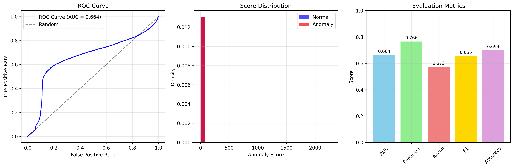
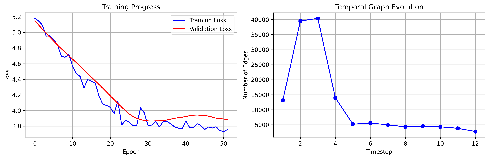

```
# GRAM & Temporal GRAM: Unified Graph Anomaly Detection Framework

This repository contains both the original **GRAM** (Graph Reconstruction-based Anomaly Model) and its temporal extension **Temporal GRAM**, offering state-of-the-art tools for spatial and temporal graph anomaly detection using GNNs, VAEs, and explainability methods.

---

## 🔍 Overview

### GRAM Family:
- ✅ `GRAM`: Graph-level anomaly detection using GCN + VAE + Grad-CAM
- ⚡ `Fast_GRAM`: Lightweight variant with TransformerConv + Bilinear decoder
- 🧪 Other baselines: OCGNN, Dominant, GAAN, GCNAE, CoNAD

### Temporal GRAM:
- 📈 Models time-evolving graphs with GCN + LSTM + VAE
- 🎯 Supports GradCAM-style interpretability over temporal dynamics

---

## 📁 Directory Structure

```
.
├── main.py                        # Entry point for GRAM training/evaluation
├── compare_faster_gram.py        # GRAM vs Fast_GRAM benchmarking
├── gram.py / faster_gram.py      # GRAM & Fast_GRAM models
├── base.py / metrics.py          # Base class and metrics
├── temporal_gram.py              # Temporal GRAM model + trainer
├── ocgnn.py, dominant.py, ...    # Other GAD baselines
├── Playground.ipynb              # Interactive experimentation
├── dataset/                      # Graph datasets
├── train_model/                  # Saved checkpoints
├── evaluation_results.png        # Temporal GRAM metrics plot
├── training_and_data.png         # Temporal GRAM training plots
├── experiment_results.json       # Temporal GRAM metrics
├── LICENSE
└── README.md
```

---

## 🚀 Installation

```bash
pip install -r requirements.txt
```

> Requirements include: `torch`, `torch_geometric`, `scikit-learn`, `numpy`, `pandas`, `matplotlib`

---

## ⚙️ Usage

### GRAM / Fast_GRAM

1. **Train on a dataset**
```bash
python main.py --model GRAM --dataset MUTAG
```

2. **Run benchmark**
```bash
python compare_faster_gram.py
```

3. **Evaluate all models**
```bash
python anomaly_detection_compare.py
```

### Temporal GRAM

```bash
python temporal_gram.py
```

Customize model parameters inside `__main__`. No external data is required for the synthetic demo.

---

## 📊 Results

### GRAM vs Fast_GRAM (MUTAG)

| Model     | AUC    | AP     | NDCG   | R@10   | P@10   | Time (s) |
|-----------|--------|--------|--------|--------|--------|----------|
| GRAM      | 0.7046 | 0.7967 | 0.9481 | 0.2647 | 0.9000 | 11.06    |
| Fast_GRAM | 0.8670 | 0.9043 | 0.9784 | 0.2941 | 1.0000 | 4.27     |

### Temporal GRAM

📈 Evaluation:


📉 Training Curve:


From `experiment_results.json`:
```json
{
  "AUC": 0.664,
  "Precision": 0.766,
  "Recall": 0.573,
  "F1": 0.655,
  "Accuracy": 0.699
}
```

---

## 🧠 Model Highlights

### GRAM / Fast_GRAM

- Deep VAE encoder with GCN or TransformerConv
- Dual decoders (attribute + structure)
- Supports Grad-CAM explainability
- Fast_GRAM: lightweight decoder + modern optimization

### Temporal GRAM

- Encoder: GCN snapshot encoder + LSTM temporal aggregator
- Decoder: attribute & structure reconstructions
- GradCAM applied across time for interpretable scores
- Supports synthetic anomaly injection & robust evaluation

---

## 🧪 API Usage Example (Temporal GRAM)

```python
model = TemporalGRAM(
    in_dim=1,
    hid_dim=64,
    latent_size=32,
    num_layers=4,
    dropout=0.1
)
trainer = TemporalGRAMTrainer(model, device='cuda')
trainer.train_epoch(training_data)
results = trainer.evaluate(training_data)
```

---

## 📌 Key Features

- 🔧 Modular architecture for plug-and-play GNN anomaly detectors
- 🎯 Grad-CAM support for interpretability (spatial & temporal)
- ⚡ TransformerConv + BilinearDecoder in Fast_GRAM for efficiency
- 🧪 Evaluation metrics: AUC, AP, NDCG, Recall@k, Precision@k
- ⏱️ Synthetic anomaly generation for temporal scenarios

---


## ⚖️ License

MIT License – see `LICENSE` file for details.

---
```
