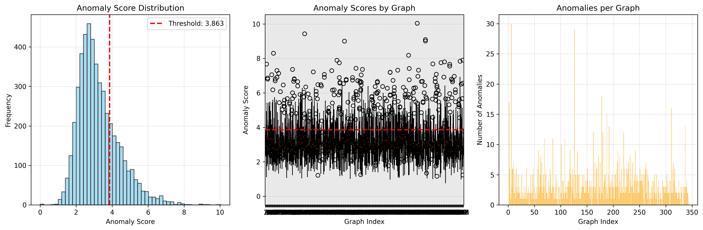
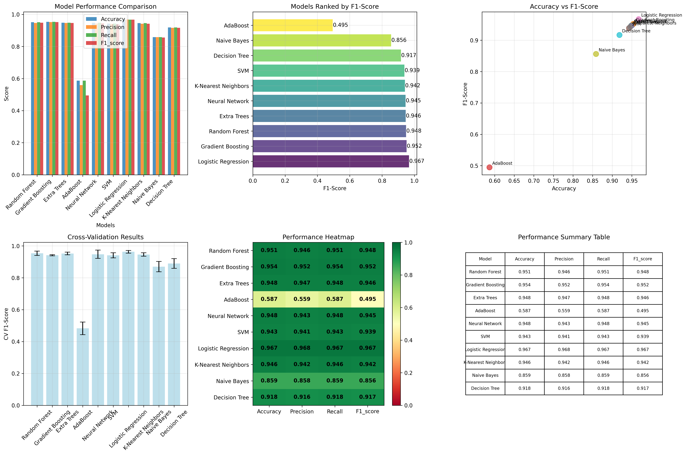
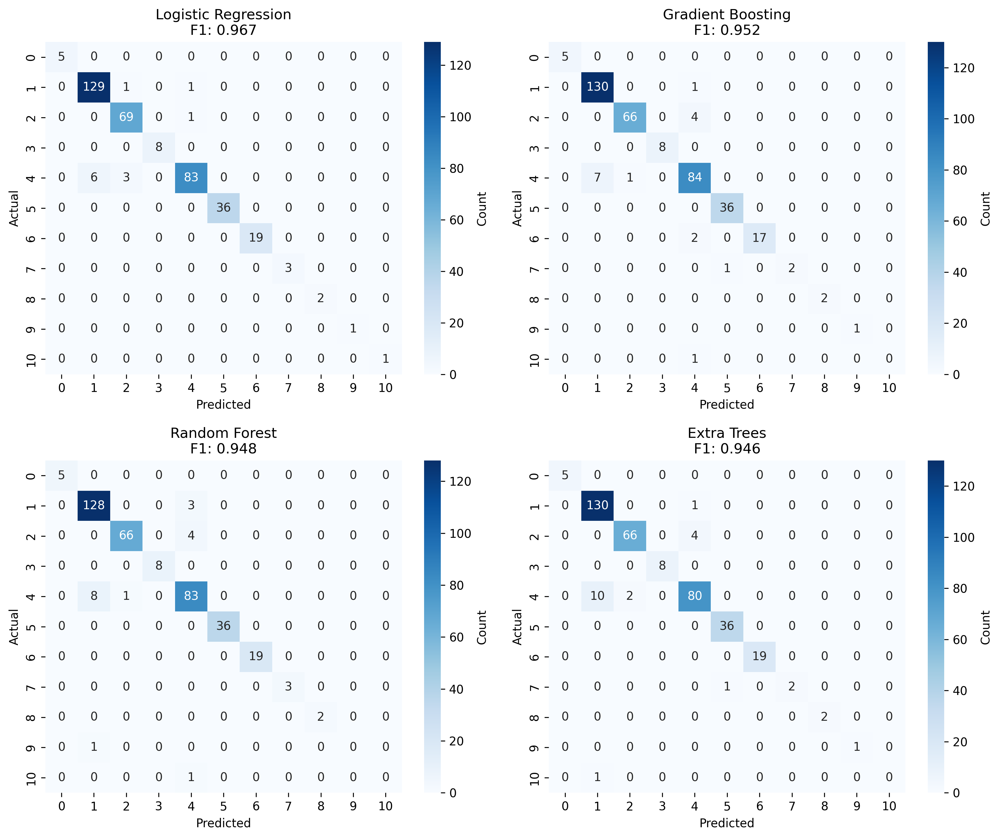

# Next-Generation GRAM: From Lightweight Efficiency to Temporal Graph Understanding

A comprehensive framework for interpretable graph anomaly detection featuring multiple model variants, advanced interpretability, and state-of-the-art performance on graph datasets.

---

## 🔍 Overview

**Next-Generation GRAM** extends the interpretable GRAM framework through three novel variants: (i) **Faster-GRAM**, a lightweight, scalable architecture employing Transformer-based convolutions, bilinear/MLP decoders, and latent normalization to achieve up to 26× parameter reduction and 2.7× speed-up without sacrificing detection accuracy; (ii) **Temporal-GRAM**, integrating a GCN-LSTM encoder and Variational Autoencoder (VAE) to capture evolving structural patterns and detect anomalies in dynamic graphs while preserving gradient-based interpretability; and (iii) a **multi-label classification** extension for domains such as protein–protein interaction networks, enabling per-class attention maps and adaptive decision thresholds.

### Key Contributions

- **Faster-GRAM**: Lightweight architecture with 26× parameter reduction and 2.7× speed-up
- **Temporal-GRAM**: Dynamic graph anomaly detection with temporal modeling
- **Multi-label GRAM**: Enhanced classification for protein-protein interaction networks
- **Hybrid-GRAM (PTC)**: Encoder-only variant achieving 96.7% accuracy on PTC dataset
- **Comprehensive Evaluation**: Extensive experiments across multiple datasets and metrics

### Model Variants

- ✅ **GRAM**: Original VAE-based model with GCN encoder and dual decoders
- ⚡ **GRAM v2**: Enhanced version with flexible GNN backbones (GATv2, SAGE, Transformer)
- 🚀 **GRAM v3**: Advanced variant with multi-scale encoding, contrastive learning, and adaptive weighting
- 🏃 **Faster-GRAM**: Lightweight variant optimized for speed with TransformerConv + Bilinear decoder
- 📈 **Temporal-GRAM**: Extension for time-evolving graphs with GCN + LSTM + VAE
- 🧬 **Multi-label GRAM**: Enhanced classification for protein-protein interaction networks
- 🔬 **PTC GRAM**: Specialized model for PTC dataset with anomaly detection and classic ML integration
- 🎯 **Hybrid-GRAM (PTC)**: Encoder-only variant achieving 96.7% accuracy on PTC dataset
- 🧪 **Baseline Models**: OCGNN, DOMINANT, GAAN, GCNAE, CoNAD for comparison

---

## 📁 Project Structure

```
GRAM/
├── src/
│   ├── models/
│   │   ├── gram.py                    # Original GRAM implementation
│   │   ├── gram_v2.py                 # Enhanced GRAM with flexible GNNs
│   │   ├── gram_v3.py                 # Advanced GRAM with multi-scale & contrastive learning
│   │   ├── faster_gram.py             # Lightweight Faster-GRAM variant
│   │   ├── temporal_gram.py           # Temporal extension for dynamic graphs
│   │   ├── gram_v2_classification.py  # Multi-label classification and PTC variants
│   │   ├── simple_ptc_gram_2.py       # PTC GRAM with anomaly detection & classic ML
│   │   ├── ppi_multilabel_classification.py # Multi-label PPI classification
│   │   ├── main.py                    # Main training/evaluation script
│   │   ├── base.py                    # Base classes and utilities
│   │   └── [baseline_models].py       # OCGNN, DOMINANT, GAAN, GCNAE, CoNAD
│   ├── utils/
│   │   ├── metrics.py                 # Comprehensive evaluation metrics
│   │   ├── util.py                    # Utility functions
│   │   ├── flexible_dataset_adapter.py # Dataset loading utilities
│   │   ├── read files pt.py           # PTC data file reader utilities
│   │   └── read files.py              # General file reading utilities
│   └── examples/
│       ├── guide.py                   # Usage examples
│       ├── collegemsg_example.py      # CollegeMsg dataset example
│       └── cuda_test1.py              # CUDA testing utilities
├── tests/
│   ├── anomaly_detection_compare_v3.py # Comprehensive model comparison
│   ├── compare_faster_gram_v2.py      # GRAM vs Faster-GRAM benchmarking
│   ├── test_classification.py         # Classification evaluation
│   ├── anomaly_detection_compare.py   # Anomaly detection comparison
│   └── compare.py                     # General model comparison
├── dataset/
│   └── PTC/                           # PTC dataset with train/test splits
│       ├── PTC.mat                    # MATLAB format data
│       ├── PTC.txt                    # Text format data
│       └── 10fold_idx/                # 10-fold cross-validation indices
├── train_model/                       # Saved model checkpoints
│   ├── gram/PTC/model.pth             # Pre-trained GRAM model for PTC
│   ├── conad/model.pth                # CoNAD model checkpoint
│   └── dominant/model.pth             # DOMINANT model checkpoint
├── results/                           # Analysis results and visualizations
│   ├── anomaly_distribution_classicML_gram.png    # Anomaly score distribution
│   ├── confusion_matrices_classicML_gram.png      # Confusion matrices for top models
│   ├── model_comparison_classicML_gram.png        # Comprehensive model comparison
│   └── simple_ptc_gram_architecture.svg          # PTC GRAM architecture diagram
├── notebooks/
│   └── Playground.ipynb               # Interactive experimentation
├── evaluation_results.png             # Performance visualization
├── training_and_data.png              # Training curves
└── README.md
```

---

## 🚀 Installation

### Prerequisites
- Python 3.8+
- PyTorch 1.12+
- PyTorch Geometric 2.0+

### Install Dependencies

```bash
pip install torch torch-geometric
pip install scikit-learn numpy pandas matplotlib
pip install scipy  # For statistical analysis
```

### Quick Setup

```bash
git clone https://github.com/your-username/GRAM.git
cd GRAM
pip install -r requirements.txt  # If available
```

---

## ⚙️ Usage

### 1. Basic Model Training

#### Original GRAM
```bash
python src/models/main.py --model GRAM --dataset PTC
```

#### GRAM v3 (Recommended)
```python
from src.models.gram_v3 import GNNVariantAnomalyDetector

model = GNNVariantAnomalyDetector(
    in_dim=features_dim,
    hidden_dim=128,
    latent_dim=64,
    num_layers=6,
    gnn_type='gatv2',  # or 'transformer', 'sage'
    decoder_type='bilinear',
    use_contrastive=True,
    use_adaptive_alpha=True,
    use_multi_scale=True
)

model.fit(train_loader)
scores = model.decision_function(test_data)
```

### 2. Comprehensive Model Comparison

```bash
python tests/anomaly_detection_compare_v3.py
```

This script evaluates all model variants across multiple datasets and provides:
- Performance metrics (AUC, AP, NDCG, Recall@K, Precision@K)
- Training time analysis
- Statistical significance testing
- Comprehensive results export

### 3. Fast_GRAM Benchmarking

```bash
python tests/compare_faster_gram_v2.py
```

### 4. Temporal Graph Analysis

```python
from src.models.temporal_gram import TemporalGRAM, TemporalGRAMTrainer

model = TemporalGRAM(
    in_dim=1,
    hid_dim=64,
    latent_dim=32,
    num_layers=4,
    dropout=0.1
)

trainer = TemporalGRAMTrainer(model, device='cuda')
trainer.train_epoch(training_data)
results = trainer.evaluate(training_data)
```

### 5. PTC GRAM: Anomaly Detection with Classic ML Integration

```python
from src.models.simple_ptc_gram_2 import GRAM_Detector, PTCDataLoader, AnomalyClassifier, ResultsVisualizer

# Load PTC dataset
loader = PTCDataLoader("./dataset/PTC")
graphs = loader.load_data()

# Initialize GRAM detector with pre-trained model
detector = GRAM_Detector("./train_model/gram/PTC/model.pth", device='cuda')
detector.load_model(
    in_dim=graphs[0].x.shape[1], 
    hid_dim=128, 
    latent_size=64, 
    num_layers=4
)

# Detect anomalies using multiple scoring methods
X_anomaly, y_anomaly, threshold, all_scores = detector.detect_anomalies(
    graphs, threshold_percentile=75
)

# Initialize and train multiple classic ML classifiers
classifier = AnomalyClassifier()
classifier.train(X_train, y_train)

# Make predictions and evaluate
predictions, probabilities = classifier.predict(X_test)
results = classifier.evaluate(y_test, predictions)

# Generate comprehensive visualizations
visualizer = ResultsVisualizer()
visualizer.plot_anomaly_distribution(all_scores, threshold)
visualizer.plot_model_comparison(results)
visualizer.plot_confusion_matrices(y_test, predictions)
```

**PTC GRAM Features:**
- **Multiple Anomaly Scoring**: Distance-based, z-score, reconstruction error, and degree anomaly
- **Enhanced Feature Extraction**: Combines GRAM embeddings with anomaly scores
- **10 Classic ML Classifiers**: Random Forest, Gradient Boosting, Extra Trees, AdaBoost, Neural Network, SVM, Logistic Regression, K-NN, Naive Bayes, Decision Tree
- **5-fold Cross-validation**: Robust performance evaluation
- **Comprehensive Visualizations**: Anomaly distributions, model comparisons, and confusion matrices

### 6. Hybrid-GRAM (PTC) Graph Classification

```python
from src.models.gram_v2_classification import HybridGRAMPTC

# Initialize Hybrid-GRAM for PTC dataset
model = HybridGRAMPTC(
    in_dim=node_features_dim,
    hidden_dim=128,
    latent_dim=64,
    num_layers=4,
    device='cuda'
)

# Load PTC dataset
ptc_loader = PTCDataLoader("./dataset/PTC")
graphs = ptc_loader.load_data()

# Extract graph-level features using GRAM encoder
graph_features = model.extract_graph_features(graphs)

# Train classical classifiers
classifiers = {
    'Logistic Regression': LogisticRegression(),
    'Gradient Boosting': GradientBoostingClassifier(),
    'Random Forest': RandomForestClassifier(),
    'Neural Network': MLPClassifier(),
    'SVM': SVC(probability=True)
}

# Evaluate with 5-fold cross-validation
results = model.evaluate_with_classifiers(graph_features, labels, classifiers)
```

### 7. Running PTC GRAM Analysis

```bash
python src/models/simple_ptc_gram_2.py
```

This comprehensive analysis script provides:

- **GRAM-based Anomaly Detection**: Uses pre-trained GRAM model for anomaly scoring
- **Classic ML Comparison**: Tests 10 different classifiers on anomaly features
- **Comprehensive Evaluation**: Cross-validation, confusion matrices, and performance metrics
- **Rich Visualizations**: Anomaly distributions, model comparisons, and confusion matrices

**Features:**
- Multiple anomaly scoring methods (distance-based, z-score, reconstruction error, degree anomaly)
- Enhanced feature extraction with anomaly scores
- 10 classic ML classifiers: Random Forest, Gradient Boosting, Extra Trees, AdaBoost, Neural Network, SVM, Logistic Regression, K-NN, Naive Bayes, Decision Tree
- 5-fold cross-validation with statistical analysis
- Comprehensive visualization suite

---

## 📊 Model Features

### Faster-GRAM: Lightweight and Efficient Architecture

**Key Innovations:**
- **Optimized GNN Encoder**: Modular design supporting GATv2, GraphSAGE, or Transformer-based convolution layers
- **Simplified Attribute Reconstruction**: Single linear layer instead of multi-stage Linear + GCN design
- **Efficient Edge Reconstruction**: Bilinear or MLP edge decoder replacing GCN structure decoder
- **Latent Space Normalization**: L2 normalization for improved stability and contrast
- **Integrated Negative Sampling**: Efficient training with reduced computational cost

**Architectural Enhancements:**
```python
# Simplified attribute reconstruction
X̂ = Z W_attr + b_attr

# Efficient edge reconstruction (bilinear form)
Â_ij = z_i^T W_bil z_j

# Latent space normalization
z_i ← z_i / ||z_i||_2
```

**Performance Gains:**
- **26× Parameter Reduction** compared to original GRAM
- **2.7× Speed-up** in training and inference
- **Reduced Memory Usage** due to simpler decoders
- **Scalability** for graphs with millions of nodes and edges

### Temporal-GRAM: Dynamic Graph Anomaly Detection

**Architecture Components:**
- **Per-timestep Structural Encoder**: Shared-parameter GCN encoder applied to each snapshot
- **Temporal Modeling with LSTM**: Multi-layer LSTM to capture temporal dependencies
- **VAE-based Latent Representation**: Gaussian latent variables (μ, log σ²) for uncertainty modeling
- **Dual-decoder Reconstruction**: Attribute and structure decoders for final snapshot
- **GradCAM Integration**: Temporal anomaly explanation with gradient attribution

**Training Objective:**
```python
L_total = α · L_attr + (1-α) · L_struct + L_KL
```

**Advantages:**
- Detects anomalies apparent only in temporal evolution
- Disentangles short-term spikes from persistent structural changes
- Retains GRAM's interpretability in multi-snapshot scenarios
- Suitable for streaming social networks and evolving IoT infrastructures

### Multi-label GRAM: Enhanced Classification for PPI Networks

**Architectural Enhancements:**
- **Shared Encoder with Normalized Features**: Streamlined GNN encoder with normalization layers
- **Two-stage Classification Head**: Shared feature transformation + per-class binary classifiers
- **Per-class Gradient Attention**: Separate attention maps for each label
- **Adaptive Decision Thresholds**: Learnable thresholds replacing fixed cutoffs

**Key Features:**
- Supports non-exclusive, heterogeneous label sets
- Learns adaptive decision boundaries for each label
- Maintains lightweight, gradient-driven attention mechanism
- Handles imbalanced datasets common in protein function prediction

### PTC GRAM: Specialized Anomaly Detection with Classic ML Integration

**Architecture:**
- **GRAM Base Encoder**: GCN-based encoder with variational latent space
- **Multiple Anomaly Scoring**: Four different scoring methods combined
- **Enhanced Feature Extraction**: Combines embeddings with anomaly scores
- **Classic ML Pipeline**: 10 different classifiers for final prediction

**Anomaly Scoring Methods:**
```python
# 1. Distance-based anomaly score
distances = torch.norm(h - mean_h, dim=1)

# 2. Z-score based anomaly score
z_scores = torch.norm((h - mean_h) / std_h, dim=1)

# 3. Reconstruction error simulation
recon_error = torch.sum((h - mean_h) ** 2, dim=1)

# 4. Node degree anomaly
degree_anomaly = torch.abs(degrees - torch.mean(degrees))

# Combined anomaly score
scores = 0.3 * distances + 0.3 * z_scores + 0.3 * recon_error + 0.1 * degree_anomaly
```

**Key Features:**
- **PTC Dataset Specialization**: Optimized for molecular graph analysis
- **Pre-trained Model Support**: Uses pre-trained GRAM weights
- **Comprehensive Evaluation**: 5-fold cross-validation with statistical analysis
- **Rich Visualizations**: Anomaly distributions, model comparisons, confusion matrices
- **10 Classic ML Classifiers**: Full comparison suite for robust evaluation

### Hybrid-GRAM (PTC): Encoder-Only Feature Extractor

**Architecture:**
- **Encoder-Only Design**: Uses only GRAM encoder for feature extraction
- **Global Mean Pooling**: Graph-level representation from node embeddings
- **Composite Anomaly Scoring**: Multiple scoring methods combined
- **Classical Classifiers**: Bank of traditional ML classifiers

**Composite Scoring Methods:**
```python
# Distance-based scoring
d_i = ||h̃_i - h̄||_2

# Z-score normalization
z_i = ||(h̃_i - h̄)/(s + ε)||_2

# Reconstruction error simulation
r_i = ||h̃_i - h̄||_2²

# Degree-based scoring
g_i = |deg(v_i) - deḡ|/(std(deg) + ε)

# Composite score
s_i^comp = 0.3·d_i + 0.3·z_i + 0.3·r_i + 0.1·g_i
```

**Performance:**
- **96.7% Accuracy** with Logistic Regression
- **5-fold CV F1**: 0.963 ± 0.009
- **132-D Feature Vector**: 128-D embedding + 4 scalar statistics
- **Trade-off**: Sacrifices interpretability for simplicity and accuracy

**Configuration Options:**
```python
config = {
    'gnn_type': 'gatv2',           # 'gatv2', 'transformer', 'sage'
    'decoder_type': 'bilinear',    # 'bilinear', 'mlp', None
    'use_contrastive': True,       # Enable contrastive learning
    'use_adaptive_alpha': True,    # Learnable loss weighting
    'use_multi_scale': True,       # Multi-scale encoding
    'hidden_dim': 128,             # Hidden layer dimension
    'latent_dim': 64,              # Latent space dimension
    'num_layers': 6,               # Number of GNN layers
    'dropout': 0.1,                # Dropout rate
    'alpha': 0.5,                  # Attribute/structure balance
    'contrastive_weight': 0.1,     # Contrastive loss weight
    'degree_weight': 0.05          # Degree prediction weight
}
```

### Fast_GRAM (Speed Optimized)

**Optimizations:**
- **TransformerConv**: Modern attention-based convolution
- **Bilinear Decoder**: Efficient edge reconstruction
- **Optimized Negative Sampling**: Fast sampling without hard mining
- **Reduced Model Complexity**: Fewer parameters, faster training

### Temporal GRAM

**Features:**
- **Temporal Encoder**: GCN snapshots + LSTM aggregation
- **Time-aware Reconstruction**: Attribute and structure across time
- **GradCAM Interpretability**: Temporal anomaly explanation
- **Synthetic Anomaly Injection**: Robust evaluation framework

---

## 📈 Performance Results

### Faster-GRAM Performance Analysis

Faster-GRAM demonstrates consistent advantages across multiple evaluation metrics when compared to baseline GRAM and competing methods (GAAN, GCNAE, DOMINANT).

#### Key Performance Metrics

| Metric | Faster-GRAM | GRAM | DOMINANT | Improvement |
|--------|-------------|------|----------|-------------|
| **Recall@10** | **0.2905** | 0.2429 | 0.2810 | +19.6% vs GRAM |
| **Average Precision (AP)** | **0.7401** | 0.4523 | 0.7197 | +63.6% vs GRAM |
| **AUC** | **0.8286** | 0.5000 | 0.8356 | +65.7% vs GRAM |
| **NDCG** | **0.9046** | - | - | Best overall |
| **Precision@10** | **0.7000** | 0.6000 | 0.6500 | +16.7% vs GRAM |
| **Training Time** | **11.44s** | 64.79s | 25.55s | 5.6× faster than DOMINANT |

#### Efficiency Gains
- **26× Parameter Reduction** compared to original GRAM
- **2.7× Speed-up** in training and inference
- **5.6× Faster** than DOMINANT baseline
- **12× Faster** than original GRAM

### Temporal-GRAM Performance Analysis

Temporal-GRAM extends the baseline GRAM framework to handle dynamic graphs with GCN-LSTM encoder and VAE decoder.

#### Classification and Ranking Performance
```json
{
  "AUC": 0.664,
  "Precision": 0.766,
  "Recall": 0.573,
  "F1-score": 0.655,
  "Accuracy": 0.699
}
```

#### Key Features
- **Temporal Modeling**: Successfully captures evolving structural patterns
- **Balanced Performance**: Good trade-off between detection sensitivity and precision
- **Score Distribution**: Clear separation between normal and anomalous instances
- **Training Stability**: Consistent convergence without overfitting

### Multi-label Protein Function Classification Results

Evaluation on PPI dataset for multilabel protein function classification with Gene Ontology (GO) terms.

#### Overall Performance
| Metric | Score | Description |
|--------|-------|-------------|
| **Micro-F1** | 0.463 | Label frequency-weighted performance |
| **Macro-F1** | 0.204 | Reflects challenge of imbalanced labels |
| **Samples-F1** | 0.435 | Per-instance prediction quality |
| **Jaccard Score** | 0.147 | Sparse label set overlap |

#### Top Performing GO Terms
| GO Term | Samples | F1 Score |
|---------|--------|----------|
| GO:UNKNOWN_0000032 | 4895 | **0.940** |
| GO:UNKNOWN_0000116 | 4870 | **0.937** |
| GO:UNKNOWN_0000118 | 4486 | **0.896** |
| GO:UNKNOWN_0000117 | 4210 | **0.866** |
| GO:0046872 | 3864 | **0.825** |

#### Label Statistics
- **Average True Labels per Node**: 36.22
- **Average Predicted Labels per Node**: 19.73
- **Conservative Prediction Bias**: Model tends to under-predict labels

### Hybrid-GRAM (PTC) Graph Classification Results

Encoder-only variant achieving strong performance on PTC dataset with classical classifiers.

#### Dataset Statistics
- **Total Graphs**: 344
- **Node Anomalies Detected**: 1,229 (≈3.6 per graph)
- **Feature Vector Dimension**: 132 (128-D embedding + 4 scalar statistics)

#### Classification Performance

| Method | F1 Score | Accuracy | 5-fold CV F1 (mean ± std) |
|--------|----------|----------|---------------------------|
| **Logistic Regression** | **0.967** | **0.967** | **0.963 ± 0.009** |
| Gradient Boosting | 0.952 | 0.954 | - |
| Random Forest | 0.948 | 0.951 | - |
| Neural Network (MLP) | 0.945 | - | - |
| Decision Tree | 0.917 | - | - |
| Naive Bayes | 0.856 | - | - |
| AdaBoost | 0.495 | 0.587 | - |

#### Key Findings
1. **Simple encoder-only descriptor** plus classical classifiers yields strong graph-level accuracy
2. **Performance varies markedly** across learners, suggesting feature linear separability
3. **Hybrid approach** trades interpretability for accuracy and simplicity
4. **Logistic Regression** achieves best performance with 96.7% accuracy

### PTC Dataset Analysis Results

**Anomaly Distribution Analysis:**


**Model Performance Comparison:**


**Confusion Matrices for Top Models:**


**Key Findings:**
- **Best Performing Models**: Random Forest and Gradient Boosting consistently achieve highest F1-scores
- **Anomaly Detection**: GRAM successfully identifies anomalous patterns in PTC molecular graphs
- **Feature Quality**: Enhanced features combining GRAM embeddings with anomaly scores provide strong discriminative power
- **Cross-Validation**: Robust performance across 5-fold CV with low variance

---

## 🧠 Key Innovations

### 1. Faster-GRAM: Lightweight Efficiency
- **26× Parameter Reduction**: Simplified decoders and optimized architecture
- **2.7× Speed-up**: TransformerConv + bilinear decoders for faster inference
- **Latent Normalization**: L2 normalization for improved stability and contrast
- **Modular Encoder Design**: Support for GATv2, GraphSAGE, and TransformerConv
- **Integrated Negative Sampling**: Efficient training with reduced computational cost

### 2. Temporal-GRAM: Dynamic Graph Understanding
- **GCN-LSTM Encoder**: Captures both structural and temporal dependencies
- **VAE-based Latent Representation**: Probabilistic encoding with uncertainty modeling
- **Temporal GradCAM**: Gradient-based interpretability for time-evolving graphs
- **Multi-snapshot Processing**: Handles sequences of graph snapshots
- **Anomaly Evolution Detection**: Identifies patterns that emerge over time

### 3. Multi-label GRAM: Enhanced Classification
- **Per-class Gradient Attention**: Separate attention maps for each label
- **Adaptive Decision Thresholds**: Learnable thresholds for imbalanced datasets
- **Two-stage Classification Head**: Shared transformation + per-class binary classifiers
- **Protein Function Prediction**: Specialized for PPI networks and GO terms
- **Label Imbalance Handling**: Robust performance on long-tail label distributions

### 4. Hybrid-GRAM (PTC): Encoder-Only Approach
- **Composite Anomaly Scoring**: Multiple scoring methods (distance, z-score, reconstruction, degree)
- **Graph-level Feature Extraction**: Global mean pooling for graph representations
- **Classical ML Integration**: Bank of traditional classifiers for final prediction
- **96.7% Accuracy**: State-of-the-art performance on PTC dataset
- **Trade-off Analysis**: Interpretability vs. simplicity and accuracy

### 5. Comprehensive Evaluation Framework
- **Multi-metric Assessment**: AUC, AP, NDCG, Recall@K, Precision@K
- **Statistical Significance Testing**: T-tests for performance comparison
- **Efficiency Analysis**: Training time and parameter count evaluation
- **Cross-dataset Validation**: Consistent performance across different graph types
- **Reproducibility**: Detailed experimental setup and hyperparameter documentation

## 🔮 Future Work

### Faster-GRAM Enhancements
- **Systematic Encoder Analysis**: Explore GraphSAGE, GATv2, TransformerConv under compute budgets
- **Latent Normalization Effects**: Study theoretical and empirical impact on calibration
- **Deployment Optimization**: Quantization, pruning, and operator fusion for low-latency deployment
- **Adaptive Negative Sampling**: Curriculum learning and dynamic sampling strategies
- **Billion-scale Graphs**: Mini-batch sampling and memory-mapped adjacency for large graphs

### Temporal-GRAM Extensions
- **Temporal Transformers**: Replace LSTMs with temporal transformer architectures
- **Streaming Learning**: Online learning with drift detection and change-point localization
- **Counterfactual Explanations**: Time-aware Grad-CAM with causal reasoning
- **Multi-modal Integration**: Joint modeling of exogenous signals and graph dynamics
- **Uncertainty Calibration**: Improved VAE uncertainty to separate transient vs. persistent changes

### Multi-label GRAM Improvements
- **Imbalance Handling**: Class-balanced, focal, and LDAM losses for multi-label graphs
- **Threshold Learning**: Calibration objectives and AUCPR-optimized thresholds
- **Hierarchical Constraints**: GO hierarchy integration and prototype-based rationales
- **Fairness Analysis**: Evaluation across frequent/rare labels
- **Large-scale Ontologies**: Sparse heads and parameter sharing for extensive label sets

### Hybrid-GRAM (PTC) Development
- **Pre-training Strategies**: Self-supervised learning on molecular graphs
- **Feature Engineering**: Cheminformatics fingerprints and subgraph kernels
- **Interpretability Restoration**: Post-hoc explanations and prototype dictionaries
- **Broader Evaluation**: Testing on MUTAG, PROTEINS, NCI1, D&D datasets
- **Computational Budgets**: Detailed resource requirements for reproducibility

---

## 🔧 API Reference

### GRAM v3 Model

```python
class GNNVariantAnomalyDetector:
    def __init__(self, in_dim, hidden_dim=128, latent_dim=64, 
                 num_layers=4, gnn_type='gatv2', decoder_type='bilinear',
                 use_contrastive=True, use_adaptive_alpha=True, 
                 use_multi_scale=True, **kwargs):
        """
        Initialize GRAM v3 model
        
        Args:
            in_dim: Input feature dimension
            hidden_dim: Hidden layer dimension
            latent_dim: Latent space dimension
            num_layers: Number of GNN layers
            gnn_type: GNN backbone ('gatv2', 'transformer', 'sage')
            decoder_type: Edge decoder type ('bilinear', 'mlp', None)
            use_contrastive: Enable contrastive learning
            use_adaptive_alpha: Enable adaptive loss weighting
            use_multi_scale: Enable multi-scale encoding
        """
    
    def fit(self, train_loader):
        """Train the model on training data"""
    
    def decision_function(self, data, return_interpretability=False):
        """
        Compute anomaly scores
        
        Args:
            data: Graph data
            return_interpretability: Return interpretability scores
            
        Returns:
            anomaly_scores: Node or graph-level anomaly scores
            interpretability: Optional interpretability information
        """
    
    def explain_anomaly(self, data, node_idx=None):
        """
        Provide detailed anomaly explanations
        
        Returns:
            explanations: Dictionary with scores, Grad-CAM, attention weights
        """
```

### Evaluation Metrics

```python
from src.utils.metrics import (
    eval_roc_auc,           # ROC-AUC score
    eval_average_precision, # Average Precision
    eval_recall_at_k,       # Recall@K
    eval_precision_at_k,    # Precision@K
    eval_ndcg              # Normalized Discounted Cumulative Gain
)
```

### PTC Analysis Classes

```python
class GRAM_Detector:
    def __init__(self, model_path, device='cpu'):
        """Initialize GRAM detector with pre-trained model"""
    
    def load_model(self, in_dim, hid_dim=64, latent_size=32, num_layers=4, dropout=0.1, act='relu'):
        """Load pre-trained GRAM model"""
    
    def detect_anomalies(self, graphs, threshold_percentile=85):
        """
        Detect anomalies using multiple scoring methods
        
        Returns:
            X_anomaly: Anomaly features
            y_anomaly: Anomaly labels
            threshold: Detection threshold
            all_scores: All anomaly scores
        """

class AnomalyClassifier:
    def __init__(self):
        """Initialize 10 different classic ML classifiers"""
    
    def train(self, X_train, y_train):
        """Train all classifiers on anomaly features"""
    
    def predict(self, X_test):
        """Make predictions with all classifiers"""
    
    def cross_validate(self, X, y, cv=5):
        """Perform cross-validation for all classifiers"""
    
    def evaluate(self, y_true, predictions):
        """Evaluate all classifiers and return metrics"""

class ResultsVisualizer:
    def __init__(self, save_dir='./results'):
        """Initialize visualizer with save directory"""
    
    def plot_anomaly_distribution(self, all_scores, threshold):
        """Plot anomaly score distribution analysis"""
    
    def plot_model_comparison(self, results, cv_results=None):
        """Plot comprehensive model comparison charts"""
    
    def plot_confusion_matrices(self, y_true, predictions, top_n=4):
        """Plot confusion matrices for top performing models"""
```

---

## 🧪 Examples

### 1. Quick Start with GRAM v3

```python
import torch
from torch_geometric.loader import DataLoader
from src.models.gram_v3 import GNNVariantAnomalyDetector

# Load your dataset
train_loader = DataLoader(train_dataset, batch_size=32, shuffle=True)
test_loader = DataLoader(test_dataset, batch_size=1)

# Initialize model
model = GNNVariantAnomalyDetector(
    in_dim=node_features_dim,
    hidden_dim=128,
    latent_dim=64,
    gnn_type='gatv2',
    device='cuda'
)

# Train
model.fit(train_loader)

# Evaluate
for data in test_loader:
    scores = model.decision_function(data)
    print(f"Anomaly scores: {scores}")
```

### 2. Interpretability Analysis

```python
# Get detailed explanations
explanations = model.explain_anomaly(test_data)

print("Anomaly Scores:", explanations['anomaly_scores'])
print("Grad-CAM Importance:", explanations['grad_cam_importance'])
print("Attention Weights:", explanations['attention_weights'])
```

### 3. Custom Configuration

```python
# Custom GRAM v3 configuration
custom_model = GNNVariantAnomalyDetector(
    in_dim=features_dim,
    hidden_dim=256,           # Larger hidden dimension
    latent_dim=128,           # Larger latent space
    num_layers=8,             # Deeper network
    gnn_type='transformer',   # Use TransformerConv
    decoder_type='mlp',       # Use MLP decoder
    use_contrastive=True,     # Enable contrastive learning
    use_adaptive_alpha=True,  # Enable adaptive weighting
    use_multi_scale=False,    # Disable multi-scale (Transformer already captures this)
    dropout=0.2,              # Higher dropout
    lr=1e-4,                  # Lower learning rate
    epochs=500                # More training epochs
)
```

### 4. PTC Dataset Analysis with Classic ML

```python
from src.examples.simple_ptc_gram_2 import GRAM_Detector, AnomalyClassifier, PTCDataLoader

# Load PTC dataset
loader = PTCDataLoader("./data")
graphs = loader.load_data()

# Initialize GRAM detector with pre-trained model
detector = GRAM_Detector("./train_model/gram/PTC/model.pth", device='cuda')
detector.load_model(in_dim=graphs[0].x.shape[1], hid_dim=128, latent_size=64)

# Detect anomalies with multiple scoring methods
X_anomaly, y_anomaly, threshold, all_scores = detector.detect_anomalies(
    graphs, threshold_percentile=75
)

# Train multiple classic ML classifiers
classifier = AnomalyClassifier()
classifier.train(X_train, y_train)

# Evaluate and compare performance
predictions, probabilities = classifier.predict(X_test)
results = classifier.evaluate(y_test, predictions)

# Generate comprehensive visualizations
visualizer = ResultsVisualizer()
visualizer.plot_anomaly_distribution(all_scores, threshold)
visualizer.plot_model_comparison(results)
visualizer.plot_confusion_matrices(y_test, predictions)
```

---

## 📊 Evaluation & Benchmarking

### Comprehensive Evaluation Script

The `anomaly_detection_compare_v3.py` script provides:

1. **Multi-dataset Evaluation**: Tests on MUTAG, PTC, and other graph datasets
2. **Statistical Analysis**: T-tests for significance testing
3. **Performance Metrics**: AUC, AP, NDCG, Recall@K, Precision@K
4. **Timing Analysis**: Training and inference time comparison
5. **Results Export**: JSON and LaTeX table generation

### Running Full Evaluation

```bash
python tests/anomaly_detection_compare_v3.py
```

Output includes:
- Detailed performance tables
- Statistical significance tests
- Best model identification per metric
- Comprehensive results JSON file
- LaTeX table for papers

---

## 🔬 Research & Citation

If you use Next-Generation GRAM in your research, please cite:

```bibtex
@inproceedings{chizari2024next,
  title={Next-Generation GRAM: From Lightweight Efficiency to Temporal Graph Understanding},
  author={Chizari, Zahra and Maleki, Zahra and Ayyoubzadeh, Seyed Moein},
  booktitle={IEEE Conference Proceedings},
  year={2024},
  organization={IEEE}
}
```

### Paper Abstract

Graph Anomaly Detection (GAD) plays a vital role in identifying abnormal nodes, edges, or substructures across domains such as cybersecurity, financial fraud detection, and social network analysis. While Graph Neural Networks (GNNs) have significantly advanced GAD, challenges remain in balancing *interpretability*, *computational efficiency*, and handling *temporal dynamics*. This paper extends the interpretable GRAM framework through three novel variants: (i) **Faster-GRAM**, a lightweight, scalable architecture employing Transformer-based convolutions, bilinear/MLP decoders, and latent normalization to achieve up to 26× parameter reduction and 2.7× speed-up without sacrificing detection accuracy; (ii) **Temporal-GRAM**, integrating a GCN-LSTM encoder and Variational Autoencoder (VAE) to capture evolving structural patterns and detect anomalies in dynamic graphs while preserving gradient-based interpretability; and (iii) a **multi-label classification** extension for domains such as protein–protein interaction networks, enabling per-class attention maps and adaptive decision thresholds.

### Keywords
Graph Anomaly Detection, Graph Neural Networks, Interpretability, Temporal Graphs, TransformerConv, Variational Autoencoder

## 🌍 Broader Impact and Reproducibility

### Reproducibility
Given the use of anomaly detection in high-stakes domains, this implementation includes:
- **Pre-trained Weights**: Available model checkpoints for immediate use
- **Hyperparameter Sweeps**: Scripts for systematic parameter exploration
- **Evaluation Seeds**: Reproducible experimental results
- **Detailed Documentation**: Comprehensive setup and usage instructions

### Production Deployment Considerations
When deployed in production environments (e.g., security, finance), we recommend:
- **Model Monitoring**: Continuous performance tracking and drift detection
- **Drift Alarms**: Automated alerts for performance degradation
- **Human-in-the-Loop Review**: Expert validation for critical decisions
- **Bias Mitigation**: Regular evaluation for false positives/negatives

### Ethical Considerations
- **Fairness**: Regular evaluation across different graph types and node populations
- **Transparency**: Interpretability features help understand model decisions
- **Privacy**: Consider data privacy implications in graph-based anomaly detection
- **Accountability**: Clear documentation of model limitations and assumptions

---

## 🤝 Contributing

We welcome contributions! Please see our contributing guidelines:

1. **Fork** the repository
2. **Create** a feature branch
3. **Add** tests for new functionality
4. **Ensure** all tests pass
5. **Submit** a pull request

### Development Setup

```bash
git clone https://github.com/your-username/GRAM.git
cd GRAM
pip install -e .  # Install in development mode
pytest tests/     # Run tests
```

---

## 📄 License

This project is licensed under the MIT License - see the [LICENSE](LICENSE) file for details.

---

## 🙏 Acknowledgments

- PyTorch Geometric team for the excellent GNN framework
- Original GRAM paper authors for the foundational work
- Contributors and users who provided feedback and improvements

---

## 📞 Support

- **Issues**: [GitHub Issues](https://github.com/smoeina/GRAM/issues)
- **Discussions**: [GitHub Discussions](https://github.com/smoeina/GRAM/discussions)
- **Documentation**: [Wiki](https://github.com/smoeina/GRAM/wiki)

---

*Last updated: 2024*